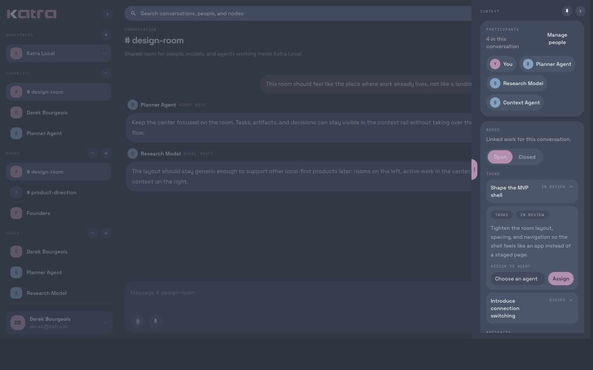
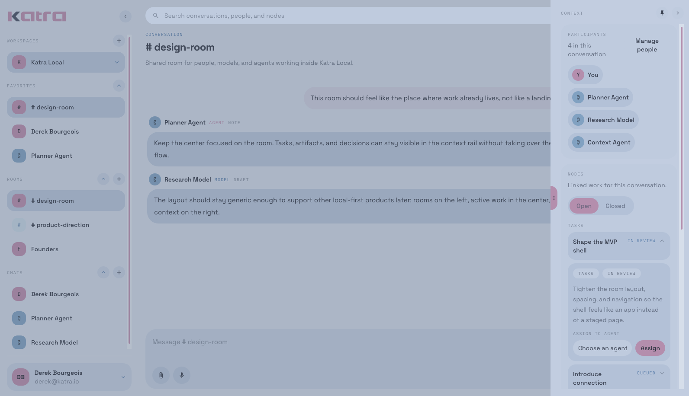

<p align="center">
  
</p>

Katra is an open source, graph-native AI workspace for conversations, tasks, and collaborative intelligence.

> [!WARNING]
> `main` now tracks the in-progress Katra v2 rewrite.
> Looking for the original proof of concept? See [`v1.0.0`](https://github.com/devoption/katra/tree/v1.0.0).

## Katra v2

Katra v2 is being rebuilt as a local-first Laravel application that can run in multiple environments. NativePHP is the first-class local shell, but the application is also intended to support server, container, and Kubernetes-style deployment targets.

The long-term direction is a graph-native system where conversations, tasks, decisions, artifacts, and related context become first-class objects instead of disposable chat history. That foundation is intended to support multi-user and multi-model collaboration, subagents, GraphRAG-style retrieval, and real-time project management.

## Planned Stack

- Laravel 13
- NativePHP
- SurrealDB v3 with a desktop-embedded and server-remote runtime strategy
- Laravel AI
- Laravel MCP
- Laravel Fortify
- Livewire
- Tailwind CSS
- Pest
- Laravel Boost for local development

## Runtime Targets

- Local-first desktop experience through NativePHP
- Traditional Laravel server deployments
- Docker-based deployments
- Helm and Kubernetes-oriented deployments

## Current Status

Katra v2 is an active rewrite. The repository is being rebuilt in small, reviewable pull requests, and preview macOS desktop artifacts are now attached to GitHub Releases as the shell evolves. The proof of concept is preserved at [`v1.0.0`](https://github.com/devoption/katra/tree/v1.0.0) for historical reference and is not being actively developed.

## Desktop Preview

The current desktop shell is now installable as a real macOS app preview. It is still early, but the downloadable build already shows the direction clearly: durable rooms, a conversation-first center pane, a contextual right rail, and a local-first desktop shell that can grow into local and remote workflows.

| Dark Theme | Light Theme |
| --- | --- |
|  |  |

## Try Katra

There are two practical ways to try Katra today.

### Download A Desktop Preview

- Browse the [GitHub Releases](https://github.com/devoption/katra/releases) page and download the latest macOS desktop asset for your machine.
- Choose the architecture-specific asset that matches your Mac when it is available: `x64` for Intel, `arm64` for Apple Silicon.
- Desktop preview builds now bundle the local Surreal runtime instead of expecting a separate machine-local `surreal` CLI install.
- Current desktop builds are preview-quality and use ad-hoc macOS signing, so macOS may require `Open Anyway` or a control-click `Open` flow the first time you launch it.

### Run From Source

```bash
composer setup
composer native:dev
```

That path installs dependencies, prepares the Laravel app, bootstraps NativePHP, and starts the local desktop development loop.

### Configure AI Providers

The Laravel AI SDK is installed and its conversation storage migrations are part of the application now.

- For hosted model access, set `OPENAI_API_KEY` and leave `AI_DEFAULT_PROVIDER=openai`.
- For local model experiments, set `AI_DEFAULT_PROVIDER=ollama` and point `OLLAMA_BASE_URL` at your local Ollama instance.
- Additional provider keys and per-capability defaults are available in [config/ai.php](config/ai.php) if you want to swap providers later.
- Some capabilities still default to specific providers like Gemini or Cohere, so if you want everything to follow your primary provider you should update the operation-specific defaults in `config/ai.php` as well.

The current AI foundation test uses agent fakes, so the repo test suite does not require live provider credentials just to verify the integration.

## Planning Docs

- [Katra v2 Overview](docs/v2-overview.md)
- [Katra v2 Product and Architecture Principles](docs/architecture/v2-product-and-architecture.md)
- [Katra Brand Foundation](docs/brand/README.md)
- [Issue #13: Katra v2 product vision and architecture principles](https://github.com/devoption/katra/issues/13)

## Contributing

Contributions are welcome as the rewrite takes shape. For now, the best place to follow the work is the issue tracker and the planning docs linked above.

Repository workflow, commit conventions, and release policy are documented in [CONTRIBUTING.md](CONTRIBUTING.md).

Optional local AI tooling setup is documented in [Laravel Boost Setup](docs/development/laravel-boost.md).
Native desktop bootstrap, release artifacts, and local shell setup are documented in [NativePHP Desktop Setup](docs/development/nativephp.md).

## License

Katra is open-sourced software licensed under the [MIT License](LICENSE).
